<h1 align="center">Hi 👋, I'm Sarang</h1>

<h3 align="center">A passionate AI & Web Developer from Thapar University</h3>

  

---

## 🏆 GitHub Trophies

  

---

## ⚙️ My Core Stack

- 💻 **Programming:** Python, C, C++, JavaScript
- 🤖 **AI/ML:** Pandas, Scikit-learn, OpenCV, MediaPipe
- 🌐 **Frontend:** React, Tailwind CSS, TypeScript, HTML, CSS
- 🔧 **Backend:** Flask
- 🗄️ **Databases:** MySQL, MongoDB
- 🐧 **Tools:** Git, GitHub, Linux, VS Code
- 🧠 **Currently Learning:** Deep Learning, AI Agents, Computer Vision, AOD-based AQI Models

---

## 💬 About Me

- 🎓 2nd Year B.Tech AIML student at **Thapar University**
- 🧠 I love building with **Python, Flask, React, Machine Learning, and Computer Vision**
- 🚀 Interested in **AI-powered applications and real-world problem solving**
- 🧩 Exploring **AI Resume Bots, Mood-based Recommendation Systems, Computer Vision, and ML applications**
- 💡 Always learning, building, and experimenting with new technologies

---

## 🛠️ Languages and Tools

  

---

## 📊 GitHub Stats

  

  

---

## 🔥 Recent Projects

| Project | Description |
|---|---|
| 🧠 **StrokeRisk AI** | ML + Flask + React application for stroke-risk prediction |
| 🤖 **Resume Ranker Bot** | AI-powered resume and skill matching system |
| 🎵 **Mood-based Song Recommender** | Music recommendation system using Spotify API |
| 📊 **EV Cost Prediction** | ML-based EV charging cost estimation |
| 🧪 **Gesture Pong Game** | Real-time computer vision game using OpenCV + MediaPipe |

---

## 📫 Connect With Me

<table align="center">
  <tr>
    <td align="center">
      
    </td>
    <td align="center">
      
    </td>
    <td align="center">
      
    </td>
  </tr>
</table>
---

> 🕉️ **“कर्मण्येवाधिकारस्ते मा फलेषु कदाचन।  
> मा कर्मफलहेतुर्भूर्मा ते संगोऽस्त्वकर्मणि॥”**

> _You have a right to perform your duties, but not to the fruits of your actions.  
> Do not let the outcome be your motive, nor let your attachment be to inaction._

---

  <i>Thanks for visiting my profile! ⭐</i>

