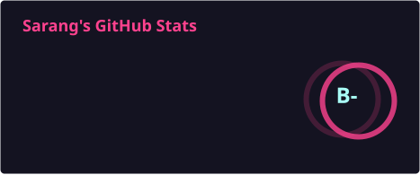
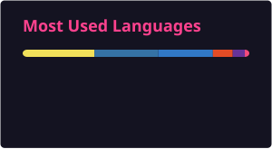

<h1 align="center">Hi 👋, I'm Sarang</h1>

<h3 align="center">AI/ML Engineering Student • Computer Vision • MLOps</h3>

  

---

## 🏆 GitHub Trophies

  

---

## ⚙️ My Core Stack

* 💻 **Programming:** Python, C, C++, JavaScript, TypeScript
* 🤖 **AI/ML:** PyTorch, Scikit-learn, XGBoost, OpenCV
* 👁️ **Computer Vision:** OpenCV, YOLO, MediaPipe
* 🌐 **Frontend:** React, Next.js, Tailwind CSS, HTML, CSS
* 🔧 **Backend:** FastAPI, Flask
* 🗄️ **Data & Databases:** Pandas, NumPy, MySQL, MongoDB
* 🐳 **Engineering:** Docker, Git, GitHub Actions, Linux
* 🧠 **Focus:** Machine Learning, Computer Vision, MLOps, AI Systems

---

## 💬 About Me

* 🎓 3rd Year B.Tech **Artificial Intelligence & Machine Learning** student at **Thapar Institute of Engineering & Technology**
* 🧠 I enjoy building **machine-learning systems, computer-vision applications, and practical AI products**
* 🔬 Interested in **reproducible ML workflows, model evaluation, deployment, and reliable AI systems**
* 🚀 Currently working on projects involving **cybersecurity, computer vision, MLOps, and intelligent applications**
* 💡 Always learning, building, testing, and experimenting with new ideas

---

## 🛠️ Languages and Tools

  

---

## 🚀 Featured Projects

| Project                 | Description                                                                                                                             |
| ----------------------- | --------------------------------------------------------------------------------------------------------------------------------------- |
| 🛡️ **AI-Powered-NIDS** | ML-powered network intrusion detection using XGBoost, autoencoder-based anomaly detection, SHAP explainability, FastAPI, and Streamlit. |
| 🔄 **Trikon**           | Three-way financial reconciliation and matching system for orders, settlements, and bank statements.                                    |
| 🌱 **AgriDrone**        | Computer vision pipeline for crop disease detection using YOLO-based object detection, model export, and benchmarking.                  |
| 📈 **ETSI Watchdog**    | Data drift monitoring library using PSI-based checks and dataset/version comparison.                                                    |
| 🧪 **ETSI FailPrint**   | Diagnostic tooling for identifying and analyzing machine-learning failure patterns.                                                     |
| 🚌 **SmartRide+**       | Public transport assistant built around GTFS data with simulated transit, ETA, crowd, and emergency workflows.                          |

> 🔎 ETSI Watchdog and ETSI FailPrint include contributions and maintenance work on upstream open-source libraries.

---

## 📊 GitHub Stats

  

  

---

## 🎯 What I'm Building Toward

**AI/ML Engineering**
Building systems that go beyond model training — from data pipelines and evaluation to APIs, interfaces, and deployment.

**Computer Vision**
Working with object detection, image processing, model optimization, and real-world vision applications.

**MLOps & Reliability**
Exploring data drift, model evaluation, reproducibility, monitoring, testing, and reliable ML workflows.

---

## 📫 Connect With Me

<table align="center">
  <tr>
    <td align="center">
      
    </td>
    <td align="center">
      
    </td>
    <td align="center">
      
    </td>
  </tr>
</table>

---

> 🕉️ **“कर्मण्येवाधिकारस्ते मा फलेषु कदाचन।
> मा कर्मफलहेतुर्भूर्मा ते संगोऽस्त्वकर्मणि॥”**

> *You have a right to perform your duties, but not to the fruits of your actions.
> Do not let the outcome be your motive, nor let your attachment be to inaction.*

---

  <i>Thanks for visiting my profile! ⭐</i>

